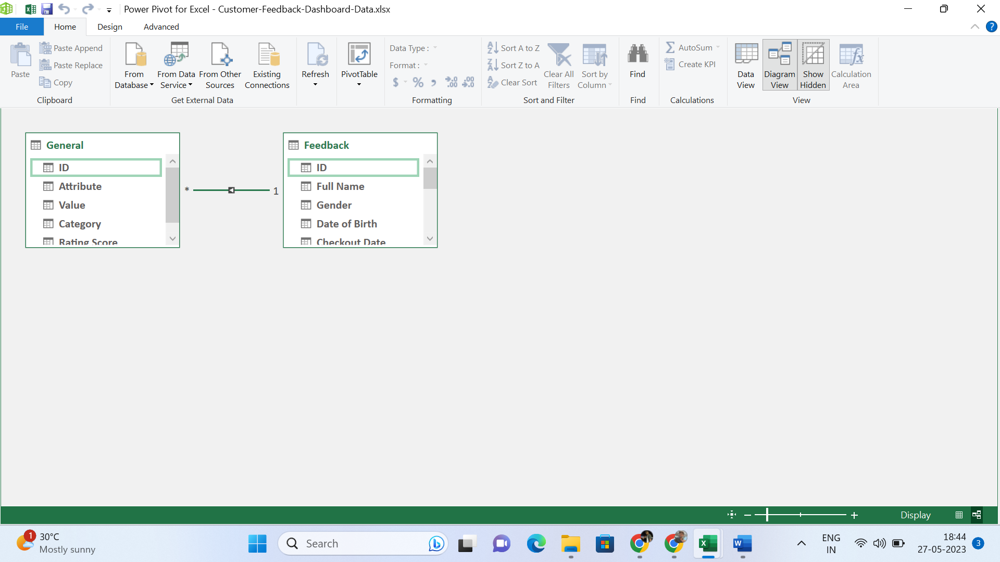
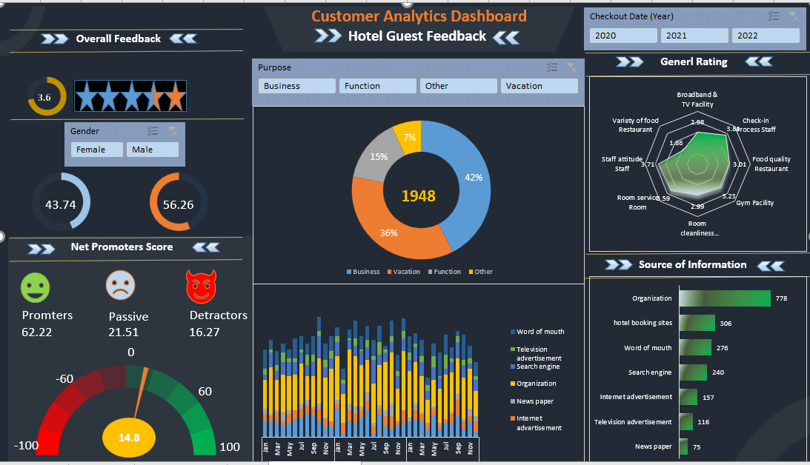

# Customer_Analytics

___________________
## Problem Statement
In today's digital landscape, the abundance of data is transforming the way businesses operate, leading to a greater demand for data analysts and business analytics professionals. While large companies have the resources to hire specialized experts to analyze their data, smaller and medium-sized organizations often struggle to capitalize on the benefits of analytics due to cost constraints and limited access to sophisticated tools. To address this issue, I have focused on leveraging the power of Microsoft Excel, a widely accessible and cost-effective solution. By implementing a few simple techniques, it is possible to create compatible dashboards, as exemplified by my work on a customer analytics dataset.

## Overview
  This particular project revolves around hotel management, encompassing the collection of relevant data through daily entries. The data includes customer information, staff attributes, feedback provided by customers regarding the services offered by the hotel, as well as marketing metrics. By utilizing this data, we can conduct a comprehensive analysis of the hotel's strengths and weaknesses, evaluate the overall customer experience, and generate practical recommendations based on the customer information gathered.

## Project scope
 This project primarily revolves around leveraging the techniques and tools offered by MS Excel to effectively manage and transform data, ultimately enabling the visualization of data in a user-friendly manner. While the project employs hotel management data, the techniques employed can be applied across various industries. The main objective is to implement data-driven business intelligence techniques in small business units, aiming to enhance operational efficiency and streamline processes.

## Data collection & Preparation
 I have obtained the data for this project from the records of XYZ Residential Hotel system, collected through the Chrome browser. In order to facilitate the data processing, I have employed Excel Power Query, a powerful transformation tool. Using this tool, I merged data from various tables and structured it in a more accessible format.
 After transforming the data, I loaded it into a data model within Excel. Leveraging the data model feature, I was able to utilize Power Pivot and facilitate data visualization. This feature also allowed for easy connections with different databases, enhancing the overall data analysis process.
For summarizing the data, I utilized the capabilities of Power Pivot to aggregate the information as per the requirements of the analysis.
In terms of data modeling, given the simplicity of the tabular data, I opted for a snowflake data modeling approach. Firstly, I merged the Category table and Feedback table with the General table using the Power Query merge function. Subsequently, in Power Pivot, I established a relationship between the Feedback table and the General table, utilizing a one-to-many relationship.

-------------------

## Key findings
  In the project I've been working on, I focused on various techniques. Here are the specific areas I concentrated on:
- I utilized Excel to create tables and define arrays.
- I employed data transformation techniques using Excel Power Query.
- I utilized data connections and modeling techniques.
- I leveraged Power Pivot to summarize the data effectively.

## Dashboard

-------------------
  In this dashboard, I incorporated three slicers: one for gender, another for years, and the third for purpose type. These slicers allow us to filter the data and save time. Although Excel has limited visuals compared to other visualization tools, I made use of color themes to maintain an attractive dashboard. Additionally, I included a gauge parameter to indicate the Net Promoter Score, which serves as a visual representation.
  
## Implementaion and Impact
    In this project, my main focus was on the working procedure rather than specific metrics. I believe that in small and medium organizations, utilizing the data generated in day-to-day processes can reveal hidden patterns and greatly enhance our decision-making abilities. To ensure cost-efficiency, leveraging Google Sheets and Excel is the most effective method, as it has the potential to improve the accuracy of the decision-making process. Moreover, we can utilize the internet as a valuable resource for further learning in this area. I practiced the techniques used in this project through a YouTube channel, which you can find at.

## Recommendations
   In today's generation, we are witnessing a massive amount of data being generated across various sources. Effectively harnessing this data can prove to be extremely beneficial for businesses. Surprisingly, we can implement Business Intelligence using simple techniques without incurring any costs by utilizing Excel.

## Lessons learned
   During my work with the data, I gained several important insights. I discovered that creating visuals and organizing metrics appropriately is a powerful way to effectively communicate information. However, I must admit that I encountered some challenges in this aspect. Managing time and implementing the project step by step until completion taught me valuable lessons about the importance of time management techniques. Additionally, I greatly benefited from the insights shared by my friends, which helped me gain a deeper understanding of the project.

## Conclution
  Based on the information provided, it can be concluded that the project primarily emphasized understanding and implementing the process rather than focusing heavily on specific metrics. The belief was that knowing the "how" of a process leads to a better understanding of the "why." The project's underlying objective was to leverage business intelligence within business processes to simplify and improve the decision-making process. By utilizing data effectively, the aim was to make informed decisions that are both easier and more accurate. The project highlighted the importance of techniques and tools like Excel in achieving this goal. Overall, the project's focus on process knowledge and the integration of business intelligence demonstrated a commitment to enhancing decision-making through data-driven insights.

